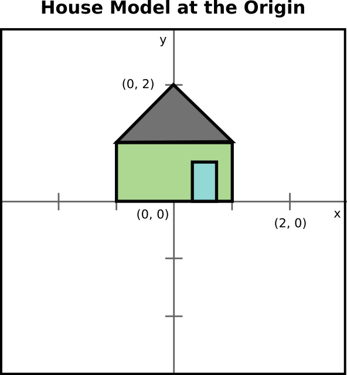
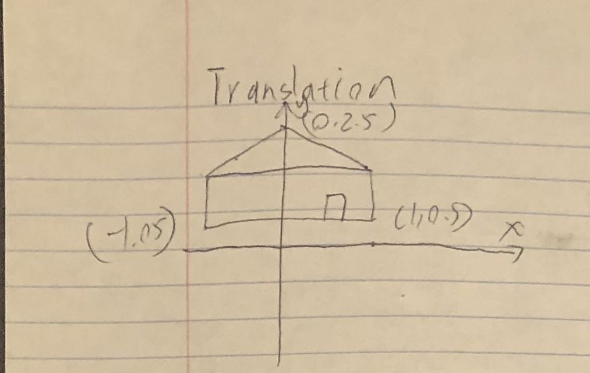
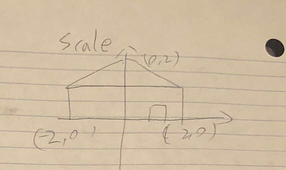
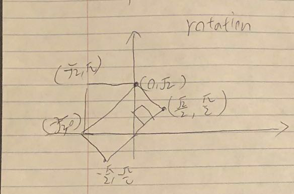
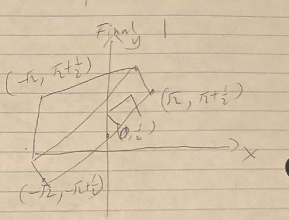
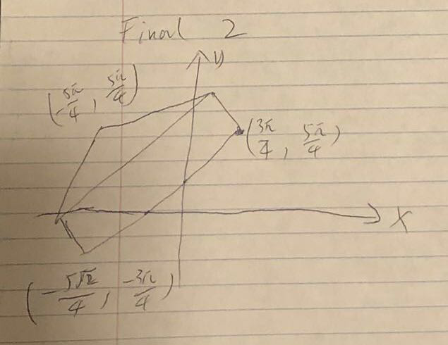
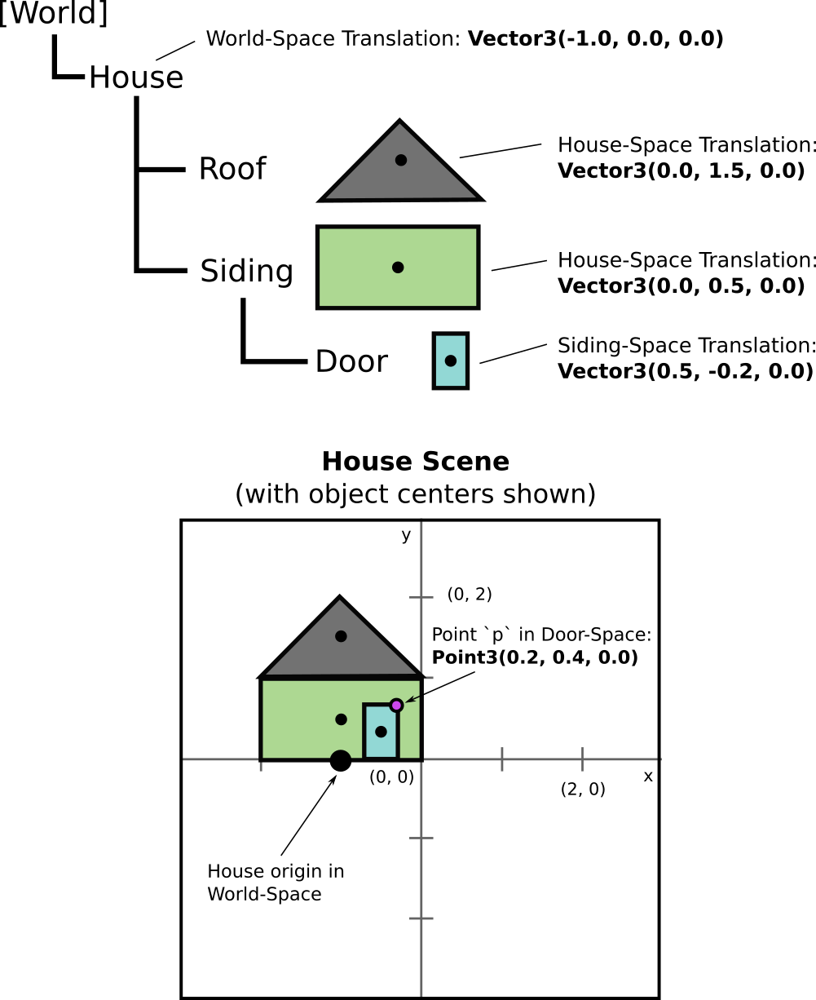

# Assignment 4 (Dance) Worksheet

## Q1: Transformations with Matrices

As you know from class, all affine transformations (translation, rotation,
scaling, shear) can be represented with 4x4 matrices. We can use
matrices to compose a series of transformations, which makes this a powerful
mechanism to use in computer graphics and animation.

You may already be familiar with MinGfx's `Matrix4` class from previous
assignments. Using a piece of paper or a drawing program, show the result of
each **transformation** on the house in the picture below, and show
the result of each **transformation composition**. Since this is a 2D example,
assume that all transformations happen in the XY-plane. Please include axis
labels and a title on each drawing.

```
// Transformations
Matrix4 translation = Matrix4::Translation(Vector3(0.0, 0.5, 0.0));

Matrix4 scale = Matrix4::Scale(Vector3(2.0, 1.0, 1.0));

Matrix4 rotation = Matrix4::RotateZ(GfxMath::toRadians(45.0));
```

```
// Transformation compositions
Matrix4 final1 = translation * scale * rotation;

Matrix4 final2 = rotation * scale * translation;
```

The initial model is located at the origin:



--------------------------------------------------------------------------------

Include your pictures for each diagram here (there should be 5 total)


### House Model after translation



### House Model after scale



### House Model after rotation



### House Model after final1



### House Model after final2



--------------------------------------------------------------------------------


## Q2: Hierarchical Transformations

Now, imagine that we wanted to represent each part of the house as separate
objects in a *scene graph*. Look back at **Lecture 17 - Animated Characters**
for more background information on this topic. For the purpose of this
worksheet, we'll focus on translations only, but keep in mind that all other
affine transformations (scale, rotate, and shear) all can be applied in the
same way! The scene graph for our example house scene is shown in the graphic
below:



```
// Transforms points in the door's coordinate system to the siding's coordinate system.
Matrix4 doorToSiding = Matrix4::Translation(Vector3(0.5, -0.2, 0.0));

// Transforms points in the siding's coordinate system to the house's coordinate system.
Matrix4 sidingToHouse = Matrix4::Translation(Vector3(0.0, 0.5, 0.0));

// Transforms points in the house's coordinate system to the world's coordinate system.
Matrix4 houseToWorld = Matrix4::Translation(Vector3(-1.0, 0.0, 0.0));
```

Given the above matrices and the scene graph defined in the image, first
show the combined transformation from Door-Space into World-Space as a matrix
multiplication, then show how to transform the point `pInDoorSpace` into
World-Space. Lastly, show the numeric representation of `pInWorldSpace`.

```
// The magenta point `p` from the diagram, in Door-Space
Point3 pInDoorSpace = Point3(0.2, 0.4, 0.0);

// Combined transformation from Door-Space -> World-Space
Matrix4 doorSpaceToWorldSpace = houseToWorld * sidingToHouse * doorToSiding;

// The point `p` in world space
Point3 pInWorldSpace = doorSpaceToWorldSpace * pInDoorSpace;

std::cout << "p in World-Space: " << pInWorldSpace << std::endl;
p in world-Space: (-0.3, 0.7, 0.0)
```
