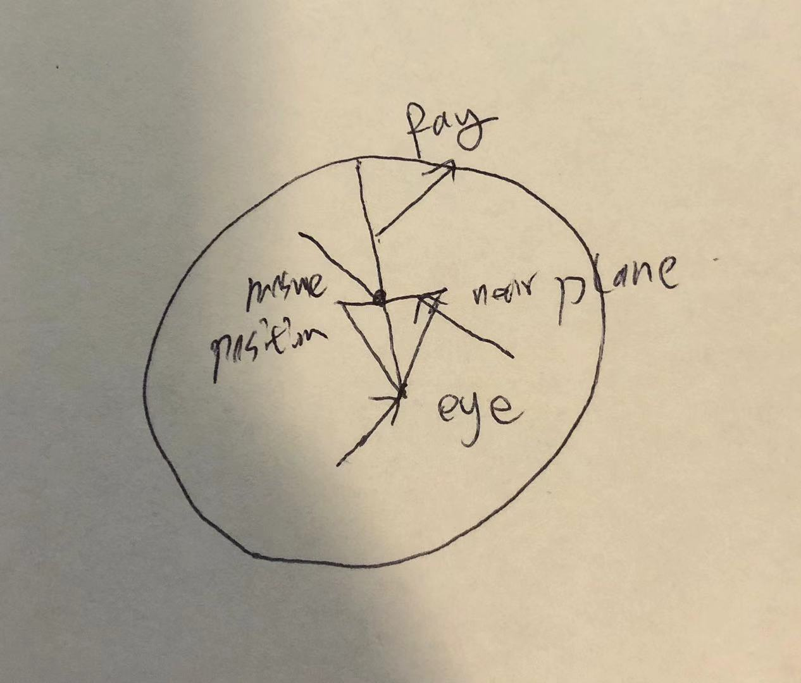

# Assignment 6 (Harold) Worksheet

For this assignment, one of the key parts is to check what part of the virtual
environment your mouse is currently touching - useful for determining what
type of stroke should be drawn when the mouse is clicked and dragged.


## Q1: Mouse-Sky Intersections (Part 1)

From the handout, we know that the sky here is really just a giant sphere
with a radius of 1500.0 units. In order to calculate where in the sky our
mouse is pointing in the scene, we need to perform a *ray-sphere
intersection* test. The ray starts at the eye location (camera position), and goes
through the current mouse location on the near clipping plane. This ray can be
traced to figure out where it intersects the sky sphere.

Create a top-down diagram of the scene including the sky sphere, the camera,
the mouse position, and the aforementioned ray from the eye through the mouse
position.

You can use the following images as inspiration for the shapes that you draw
in your diagram (replace this image with your final diagram):




## Q2: Mouse-Sky Intersections (Part 2)

Now, let's create the building blocks for the method `Sky::ScreenPtHitsSky()`,
which tests to see where the ray from the eye through the mouse intersects the
sky sphere! We're given the following information in this method:

- Camera view matrix (`Matrix4 view_matrix`)
- Camera projection matrix (`Matrix4 proj_matrix`)
- `Point2` normalized device coordinates of mouse (`Point2 normalized_screen_pt`)
    - Inclusive range [-1, 1]
    - `Point2(-1, 1)` is the upper left corner, and `Point2(1, -1)` is the
      lower right

1. Find the camera's position in world space. Use your graphics knowledge from
   this course and the information above to construct the `Point3 eye`:

```
/* Hint: you may want to define an intermediate matrix here */
Matrix4 Inte_martix = view_matrix.Inverse();  // define a intermefiate matrix
Point3 eye = Inte_martix.ColumnToPoint3(3); // find the the position in world space
```

2. Construct the mouse pointer location in world space. We consider the mouse
   to be on the near clipping plane of the camera (this should sound familiar
   from your drawing in Q1!). In order to grab this point, MinGfx has a handy
   helper function called
   [`GfxMath::ScreenToNearPlane`](https://ivlab.github.io/MinGfx/classmingfx_1_1_gfx_math.html#a2086a2f885f887fb53da8a5adb5860f0).
   Use the MinGfx documentation at the link and the variables given above to
   construct the world-space representation of the mouse location:

```
Point3 mouseIn3d = GfxMath::ScreenToNearPlane(view_matrix,proj_matrix, normalized_screen_pt); // follow the instruction
```

3. Create the ray from the eye through the world-space mouse location on the
   near plane. Use MinGfx's builtin `Ray` class for this.

```
Ray eyeThroughMouse = Ray(eye,(mouseIn3d - eye).ToUnit());  //eye through mouse
```

4. Use the
   [`Ray::IntersectSphere()`](https://ivlab.github.io/MinGfx/classmingfx_1_1_ray.html#affe83ef9859560bcb24343017cb86d88)
   method to find the intersection point of the `eyeThroughMouse` ray and the
   sky sphere. This method contains one bit of C++ syntax that you may not
   have seen before - output parameters. The `Ray::IntersectSphere()` method
   sets both `iTime` and `iPoint` this way. Usually, best practice here is to
   declare a variable of the correct type before you call the method, then
   pass in a *reference* to this variable. For example:

```
// this function takes pointer types as arguments, so these are pointers to locations in memory
// when you see this, it's a good bet the function will be modifying the data at those memory
// locations and those mods will hold outside the function when it returns because it's actually
// modifying the original location in memory.
bool someFunction(float * x_ptr, Vector3 * v_ptr) {
   *x_ptr = 8.1;
   v_ptr->Set(1.0, 2.0, 1.0);
   return true;
}

// Usually we call functions more like this:
bool someOtherFunction(float x, Vector3 v) {
  // I can change this value inside the function but it doesn't affect whatever I passed into the function
  x = 8.1;
  v.Set(1.0, 2.0, 1.0);
}

// Declare output parameter `x`
float x;
Vector3 v;

// Call someFunction with output parameter
someOtherFunction(x, v);
// x and v haven't changed after calling someOtherFunction because we are passing them "by value"

someFunction(&x, &v);
// here, x and v have changed because we have passed them by reference, which is often done in C++
// by using pointers.  Here, the "&" means "the address of", which is a pointer type.  So, we are
// passing the address of the memory location where x and v are stored.  The function modifies the
// memory at that address so any changes from inside the function persist outside the function.

```

   Using the variables declared from the previous steps, write a code snippet
   that captures the return value of the sphere intersection test, as well as
   the `t` value and the `point` where the ray intersects the sphere.

```
// Declare output parameters

bool intersects = eyeThroughMouse.IntersectSphere(Point3::Origin(), 1500,&t, &point); // since the radius is 1500
```
